# 🍍 Ananas Talk — 우리만의 아지트

> 채팅은 기본, 방명록과 파도타기까지. 미니홈피 시절의 감성을 지금의 메신저로.

[](https://nodejs.org)
[](https://socket.io)
[](https://railway.app)

🔗 **배포 주소:** https://web-production-4bf0d.up.railway.app

---
## 이미지 미리보기


| 메인 화면 | 채팅방 화면 |
|:---:|:---:|
|  |  |

---


## 📌 프로젝트 배경

### 왜 만들었나

국내 메신저 시장은 카카오톡이 **MAU 4,819만 명, 국내 인터넷 사용자의 97.2%** 를 점유하는 독점 구조입니다.
<br>대화는 가능하지만 "나만의 공간"을 가진 메신저는 없었습니다.
<br>([출처: The Korea Times](https://www.koreatimes.co.kr/business/companies/20250924/kakaotalk-leads-in-users-tiktok-lite-in-usage-time-data))

한편 Z세대를 중심으로 **Y2K · 뉴트로 감성**이 2024~2026년 주요 소비 트렌드로 자리잡았습니다.
<br>"겪지도 않은 걸 마치 겪은 듯이 즐기는" 레트로 소비 패턴이 확산되고 있습니다.
<br>([출처: KB Think](https://kbthink.com/main/living-finance/consumption-life/mz-consumption/retro.html) · [제일매거진](https://magazine.cheil.com/49544))

싸이월드 미니홈피는 전성기 **회원 3,200만 명, 미니홈피 3,160만 개, 도토리 연 매출 1,000억 원**을 기록하며
<br>한국 SNS 역사상 가장 큰 커뮤니티 문화를 만들어냈습니다.
<br>([출처: 위키백과](https://ko.wikipedia.org/wiki/%EC%8B%B8%EC%9D%B4%EC%9B%94%EB%93%9C) · [이코노미스트](https://economist.co.kr/article/view/ecn202412110020))

**아나나스는 이 두 가지를 결합합니다 —**
레트로 감성의 "나만의 아지트" + 현대적 실시간 채팅 + 보안

---

### PWA를 선택한 이유

설치 없이 브라우저만으로 접근 가능한 PWA는 진입 장벽을 최소화합니다.





| 지표 | 수치 |
|------|------|
| 일일 활성 사용자 | **2배 증가** (Starbucks PWA 도입 사례) |
| 세션 길이 | **70% 증가** (모바일 웹 대비) |
| 페이지뷰 | **20% 증가** (모바일 웹 대비) |
| 방문자 유지율 | **450% 증가** (Rakuten 24 사례) |

([출처: Magenest PWA Statistics](https://magenest.com/en/pwa-statistics/) · [PWA Stats](https://www.pwastats.com/))

---

## ✨ 주요 기능

### 실시간 채팅
- Socket.IO 기반 실시간 양방향 통신
- 타이핑 표시 (상대방 입력 중 알림)
- 메시지 검색
- 이미지 전송 (JPG · PNG · WEBP, 최대 5MB)
- 이미지 크롭 편집 후 전송 / 파일 저장

### 공감 · 답장
- ❤️ 👍 😂 😮 😢 🍍 6가지 공감 리액션
- 특정 메시지 인용 답장
- 본인 메시지 삭제

### 방 시스템
- 6자리 초대 코드로 방 생성 / 입장
- 공개 / 비공개 설정
- 방 공지 고정 (방장 전용)
- 카테고리 분류 (일상·공부·음악·취미·정보·친목·기타)
- 초대 링크 공유

### 방명록
- 방마다 독립적인 방명록 (최대 50개)

### 파도타기
- 랜덤 공개 방 자동 입장
- 친구의 친구 아지트 우선 추천 (소셜 그래프 기반)

### 프로필 & 친구
- 메인 / 서브 프로필 전환
- 프로필 사진 업로드
- 기분(무드) 6가지 설정
- 고유 CID 기반 친구 추가 / 친구 요청 시스템

### AI 어시스턴트
- Google Gemini API 연동
- 질문 · 번역 · 글쓰기 · 아이디어 지원
- 사진 속 글자 번역 (Vision API)
- 7개 언어 번역기

### 방문 통계
- 싸이월드 스타일 TODAY / TOTAL 카운터
- DB 영속 저장

---

## 보안 — OWASP Top 10 대응

[OWASP Top 10 2021](https://owasp.org/Top10/2021/) 기준 전 항목 대응

| # | 취약점 | 아나나스 대응 방식 |
|---|--------|------------------|
| A01 | Broken Access Control | 관리자 토큰 분리, `timingSafeEqual` 타이밍 공격 방지 |
| A02 | Cryptographic Failures | SQLCipher **AES-256-CBC** DB 전체 암호화 |
| A03 | Injection | 전 쿼리 **Prepared Statement** (파라미터 바인딩) |
| A04 | Insecure Design | Rate Limit 설계, 서버 전체 접속 상한 |
| A05 | Security Misconfiguration | `helmet` CSP · 보안 헤더 자동 적용 |
| A06 | Vulnerable Components | 최신 패키지 유지, `npm audit` 정기 점검 |
| A07 | Auth Failures | `ADMIN_KEY` 환경변수 분리, 코드/깃 미포함 |
| A08 | Data Integrity Failures | 이미지 MIME 타입 · 용량 서버측 검증 |
| A09 | Logging Failures | 서버 로그 파일 기록 (`logs/server_out.txt`) |
| A10 | SSRF | AI API 서버 프록시로 키 노출 완전 차단 |

### DB 암호화 스펙 (SQLCipher)
- 알고리즘: **AES-256-CBC**
- 키 유도: **PBKDF2-HMAC-SHA512** (256,000 iterations)
- 페이지 단위 개별 암호화 + 매 쓰기 시 랜덤 IV 재생성
- 무결성: 페이지별 **HMAC** 검증
- ([출처: Zetetic SQLCipher Design](https://www.zetetic.net/sqlcipher/design/) · [GitHub sqlcipher](https://github.com/sqlcipher/sqlcipher))

### Rate Limit 설계

| 구간 | 제한 |
|------|------|
| HTTP 요청 | 분당 600회 |
| AI API | 분당 20회 |
| 소켓 이벤트 | 분당 120회 |
| 서버 최대 동시접속 | 5,000명 |
| 방 최대 인원 | 500명 |

---

## ⚡ 성능 — 실측 벤치마크

> 환경: Node.js v24 / Windows 11 / localhost 직접 측정

### 응답 시간 (10회 반복)

| 지표 | 수치 |
|------|------|
| 평균 응답시간 | **10.3ms** |
| 최소 | 4ms |
| 최대 | 61ms (첫 요청 cold start) |
| 안정 구간 | 4~7ms |

### 부하 테스트

| 동시접속 | 총 요청 | RPS | P95 | P99 | 실패율 |
|---------|---------|-----|-----|-----|--------|
| 10개 | 100건 | **1,149 req/s** | 13ms | 17ms | **0%** |
| 50개 | 300건 | **1,435 req/s** | 37ms | 48ms | **0%** |
| 100개 | 500건 | **2,427 req/s** | 77ms | 83ms | **0%** |

### Socket.IO 확장성
- Node.js 단일 인스턴스 실용 한계: **10,000~30,000 동시접속**
- uWebSockets 기반 시 **3,000+ 클라이언트** 안정 처리 공식 확인
- ([출처: Socket.IO 공식 Performance Tuning](https://socket.io/docs/v4/performance-tuning/) · [DEV Community 벤치마크](https://dev.to/sahaj-b/benchmarking-socketio-servers-4n9k))

---

## 🏗️ 서버 아키텍처

```
┌─────────────────────────────────────────┐
│           클라이언트 (브라우저)           │
│         HTML · CSS · Vanilla JS         │
└──────────────┬──────────────────────────┘
               │ HTTPS / WSS
┌──────────────▼──────────────────────────┐
│           Express + Socket.IO           │
│                                         │
│  ├─ HTTP Rate Limit (express-rate-limit)│
│  ├─ 보안 헤더 (helmet)                   │
│  ├─ 압축 (compression)                   │
│  ├─ CORS 정책                            │
│  ├─ /api/ai        — Gemini 프록시       │
│  ├─ /api/translate — 번역 프록시         │
│  ├─ /api/ai-vision — Vision 프록시       │
│  └─ /health        — 헬스체크            │
└──────────────┬──────────────────────────┘
               │
┌──────────────▼──────────────────────────┐
│     SQLCipher (AES-256 암호화 SQLite)    │
│                                         │
│  rooms · messages · guestbook · stats   │
└─────────────────────────────────────────┘
```

### 소셜 그래프 & 파도타기 엔진
- `SocialGraph` — 친구 관계 무방향 그래프 (메모리)
- `FriendOfFriendMatcher` — 친구의 친구 아지트 우선 추천
- `RandomPublicMatcher` — 폴백: 무작위 공개 아지트

---

## 🛠️ 기술 스택

| 구분 | 기술 |
|------|------|
| **Frontend** | HTML5 · CSS3 · Vanilla JS · Canvas API (픽셀아트 엔진) |
| **Backend** | Node.js 18+ · Express 4 · Socket.IO 4 |
| **DB** | SQLite (SQLCipher / AES-256 암호화) |
| **보안** | helmet · express-rate-limit · validator · crypto |
| **AI** | Google Gemini API |
| **배포** | Railway |
| **PWA** | Web App Manifest |

---

## 🚀 로컬 실행

```bash
git clone https://github.com/lsjin0322/Ananas-talk.git
cd Ananas-talk
npm install
cp EXAMPLE.env .env
# .env에 DB_ENCRYPTION_KEY 등 입력
npm start
# → http://localhost:4000
```

암호화 키 생성:
```bash
node -e "console.log(require('crypto').randomBytes(32).toString('hex'))"
```

자세한 배포 가이드 → [DEPLOY.md](DEPLOY.md)

---

## 📁 프로젝트 구조

```
Ananas-talk/
├── server.js        # 메인 서버 (Express + Socket.IO)
├── db.js            # 암호화 SQLite DB 계층
├── social.js        # 소셜 그래프 & 파도타기 엔진
├── index.html       # 메인 페이지
├── script.js        # 클라이언트 로직
├── style.css        # 스타일
├── manifest.json    # PWA 매니페스트
├── portfolio.html   # 포트폴리오 페이지
├── images/          # 이미지 에셋
├── sounds/          # 배경음악
├── video/           # 인트로 영상
└── EXAMPLE.env      # 환경변수 예시
```

---

## 👩‍💻 개발자

**이수진** — AI Collaboration Developer
- Email: lsujin0322@naver.com

> Socket.IO 실시간 통신과 픽셀아트 Canvas 엔진을 처음부터 직접 구현한 개인 프로젝트.
> 레트로 감성과 현대적 보안을 함께 담았습니다.
