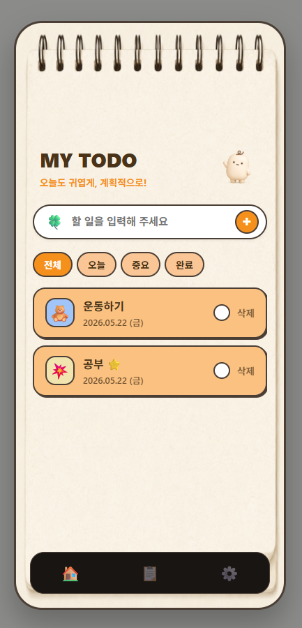
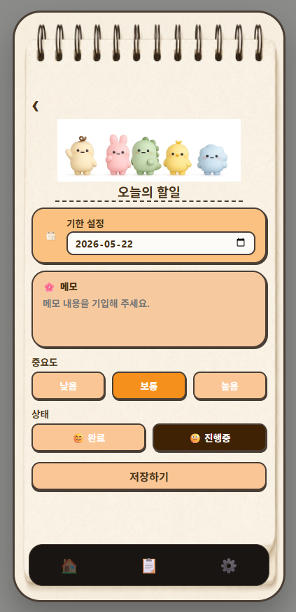
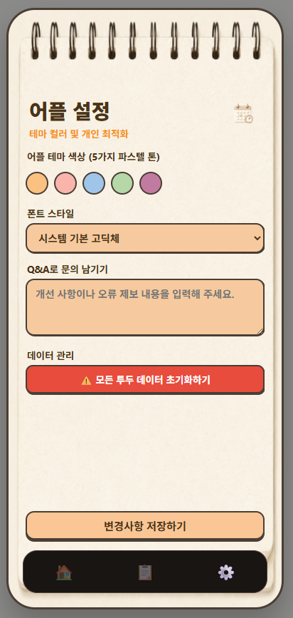

# 파스텔 톤 감성 투두리스트 (Todo List Web)

> **"오늘도 귀엽게, 계획적으로!"** > 사용자의 취향에 맞춰 5가지 파스텔 컬러 테마로 유기적인 전환이 가능한 개인 일정 관리 웹 서비스입니다.

 

## 🌐 라이브 데모 (Live Demo)
스마트폰과 PC 어디서나 접속하여 실시간으로 기능을 테스트해 볼 수 있습니다.
* **배포 주소:** [https://web-nu-liard-z1t8z5w7fg.vercel.app](https://web-nu-liard-z1t8z5w7fg.vercel.app)

 

## ✨ 주요 기능 (Key Features)

* **할 일 관리 (CRUD):** 일정을 간편하게 추가하고, 완료 상태를 체크하며, 필요 없는 항목을 삭제할 수 있습니다.
* **상세 보기 (Detail View):** 각 할 일 항목의 구체적인 내용과 완료 여부를 별도 페이지에서 정밀하게 관리합니다.
* **5가지 가변 컬러 테마 설정:** * 사용자의 무드에 맞춰 **오렌지, 핑크, 블루, 그린, 퍼플** 총 5가지의 파스텔 톤 테마를 제공합니다.
  * 설정 탭에서 테마를 변경하면 메인 카드, 입력창, 버튼 배경색까지 전체 UI 스타일이 유기적으로 연동되어 변환됩니다.
* **반응형 웹 디자인 (Mobile-First):** 스마트폰 홈 화면에 바로가기를 추가하여 실제 네이티브 앱처럼 최적화된 비율로 편리하게 사용할 수 있습니다.

 

## 🛠️ 기술 스택 (Tech Stack)

|구분|기술|
|---|---|
|**Frontend**|HTML5, CSS3, JavaScript (Vanilla JS)|
|**Deployment**|Vercel (자동 빌드 및 지속적 배포 라이브 시스템)|

 

## 📸 스크린샷 (Screen Shots)

| 메인 화면 (Todo List) | 상세 보기 (Detail) | 테마 설정 (Settings) |
| :---: | :---: | :---: |
|  |  |  |

